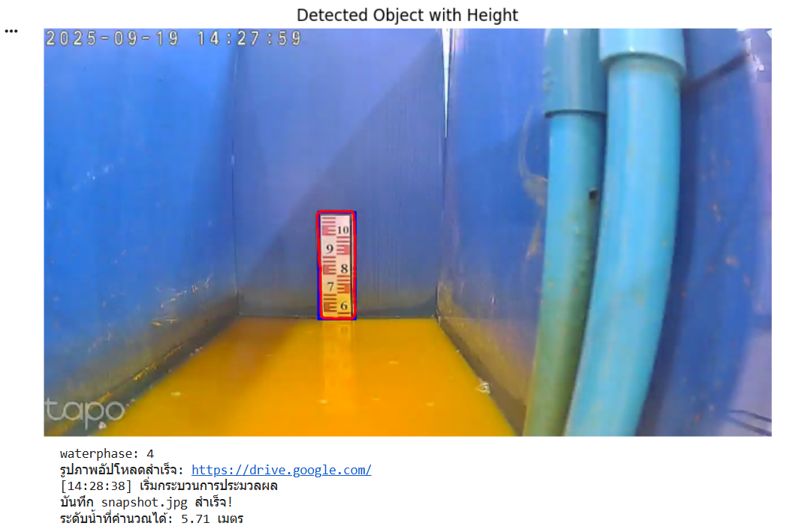

# 🌊 AquaWatch: Real-Time Water Level Monitoring using SAM

AquaWatch เป็นระบบเฝ้าระวังระดับน้ำแบบ Real-Time โดยใช้ Computer Vision และ **Segment Anything Model (SAM)** เพื่ออ่านระดับน้ำจากแถบวัดผ่านกล้อง IP Camera, เก็บหลักฐานภาพลง Google Drive, และส่งการแจ้งเตือนอัตโนมัติไปยัง LINE



---

## ⚠️ คำเตือนด้านความปลอดภัย (Security Warning)

โปรเจคนี้มีการเชื่อมต่อกับ API ภายนอก (LINE, Google Drive) **ห้าม Hard-code กุญแจ API ลงในโค้ดเด็ดขาด**

โปรเจคนี้ใช้ไฟล์ `.env` ในการจัดเก็บ Secrets ทั้งหมด:
1.  สร้างไฟล์ `.env`
2.  คัดลอกเนื้อหาจาก `.env.example`
3.  เติม "กุญแจลับ" จริงของคุณลงในไฟล์ `.env`

---

## 🏛️ สถาปัตยกรรม (System Flow)

ระบบทำงานเป็น Loop `while True` โดยมีขั้นตอนดังนี้:

1.  **Capture:** ดึงภาพ Snapshot จาก URL ของ IP Camera (ผ่าน Ngrok Tunnel)
2.  **Segment:** โหลดโมเดล SAM (vit_b) และใช้ `SamPredictor` กับ "จุดอ้างอิง" (`input_point`) ที่ตั้งค่าไว้ เพื่อสร้าง Mask ของผิวน้ำ
3.  **Calculate:** คำนวณความสูงของ Mask (pixel) ที่ได้
4.  **Calibrate:** แปลงค่า "ความสูง pixel" เป็น "ระดับน้ำ (เมตร)" โดยใช้สูตร Pixel-to-Meter Calibration ที่ได้จากการทดลอง (`Output = 11 - (height / 35.89)`)
5.  **Classify:** จัดกลุ่มระดับน้ำเป็น `waterphase` (1-7) เพื่อกำหนดระดับความอันตราย
6.  **Log:** อัปโหลดภาพ Snapshot (หลักฐาน) ขึ้นไปยัง Google Drive
7.  **Alert:** หาก `waterphase` มีการเปลี่ยนแปลงจากรอบก่อนหน้า ระบบจะส่งข้อความแจ้งเตือน (พร้อมภาพ, ระดับน้ำ, และคำแนะนำ) ผ่าน LINE Messaging API
8.  **Loop:** รอ 1 นาที (`time.sleep`) และเริ่มกระบวนการใหม่

---

## ✨ Key Features

* **AI-Powered Monitoring:** ใช้ Segment Anything Model (SAM) ในการระบุตำแหน่งผิวน้ำอย่างแม่นยำ
* **Non-Invasive:** ไม่ต้องติดตั้ง Sensor ในน้ำ ใช้เพียงกล้อง IP Camera ที่ส่องไปยังแถบวัด
* **Pixel-to-Meter Calibration:** มีการคำนวณเทียบสเกลจริง (ต้องตั้งค่าเอง)
* **Cloud Logging:** เก็บประวัติระดับน้ำเป็นรูปภาพอัตโนมัติบน Google Drive
* **Real-Time Alerts:** แจ้งเตือนผ่าน LINE ทันทีเมื่อระดับน้ำมีการเปลี่ยนแปลงเฟสความอันตราย

---

## 🛠️ Technology Stack

* **AI/CV:** PyTorch, Segment Anything Model (SAM), OpenCV, Pillow
* **Backend:** Python
* **APIs:** Google Drive API (via `google-api-python-client`), LINE Messaging API
* **Utils:** NumPy, Matplotlib (สำหรับแสดงผล), Requests, PyTz

---

## ⚙️ Setup & Installation

1.  **Clone Repository:**
    ```bash
    git clone [https://github.com/KitzSonx/RealTime-Water-Monitoring-SAM.git](https://github.com/KitzSonx/AquaWatch-Real-Time-Water-Monitoring.git)
    cd AquaWatch-Real-Time-Water-Monitoring
    ```

2.  **Install Segment Anything (SAM):**
    ```bash
    pip install git+[https://github.com/facebookresearch/segment-anything.git](https://github.com/facebookresearch/segment-anything.git)
    ```

3.  **Install Python Dependencies:**
    ```bash
    pip install -r requirements.txt
    ```

4.  **Download SAM Model:**
    (โค้ดนี้ใช้โมเดล `vit_b` ซึ่งมีขนาดเล็ก)
    ```bash
    mkdir models
    wget -P models [https://dl.fbaipublicfiles.com/segment_anything/sam_vit_b_01ec64.pth](https://dl.fbaipublicfiles.com/segment_anything/sam_vit_b_01ec64.pth)
    ```
    *(ไฟล์โมเดลนี้จะถูก `.gitignore` บล็อกไว้ ไม่ถูกอัปโหลดขึ้น Repo)*

5.  **Setup Google Drive API:**
    * ไปที่ Google Cloud Console และสร้าง Service Account
    * ดาวน์โหลดไฟล์ credentials `service_account.json`
    * สร้างไฟล์ `service_account.json.example` (ตามโครงสร้าง) เพื่อเป็นตัวอย่าง
    * *(ไฟล์ `service_account.json` จริงจะถูก `.gitignore` บล็อกไว้)*

6.  **Configure Environment:**
    * คัดลอก `.env.example` ไปเป็นไฟล์ใหม่ชื่อ `.env`
    * **เติมค่าจริงทั้งหมด:** `LINE_ACCESS_TOKEN`, `USER_ID`, `PARENT_FOLDER_ID`, `IP_CAMERA_SNAPSHOT_URL`

7.  **การเทียบสเกล (Calibration):**
    * ค่าใน `.env` (`INPUT_POINT_X`, `INPUT_POINT_Y`, `CALIBRATION_FACTOR`, `CALIBRATION_OFFSET`) เป็นค่า "Magic Number" ที่ใช้ได้กับกล้องและมุมมองของผมเท่านั้น
    * คุณต้องเปิดภาพ Snapshot ของคุณเอง, หาพิกัด (`X, Y`) ที่จะใช้เป็นจุดอ้างอิง, และคำนวณหา "สูตร" เทียบสเกล (Pixel -> Meter) ของคุณเอง

8.  **Run the Monitor:**
    ```bash
    python src/main.py
    ```

---

## 📄 License

This project is licensed under the MIT License.